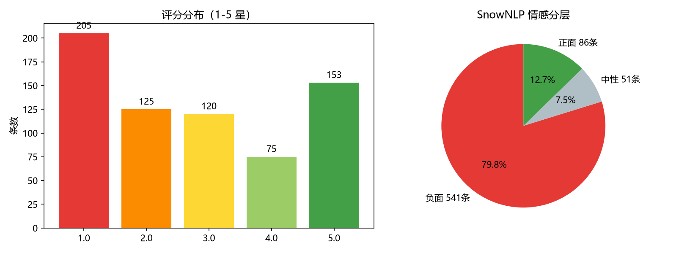
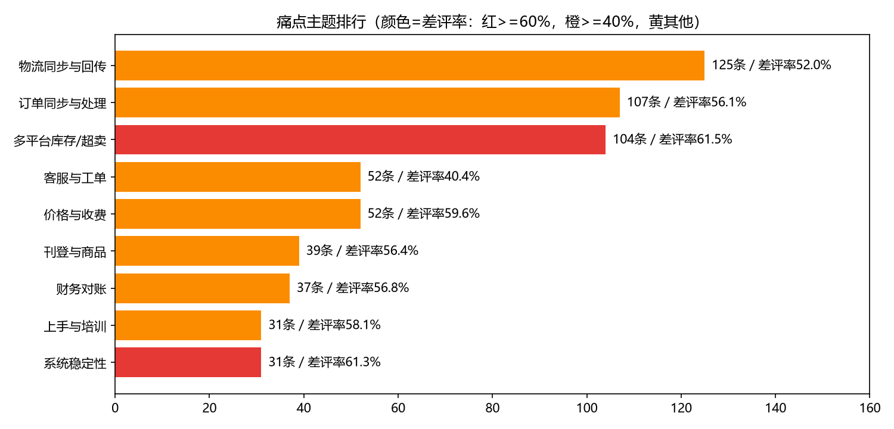
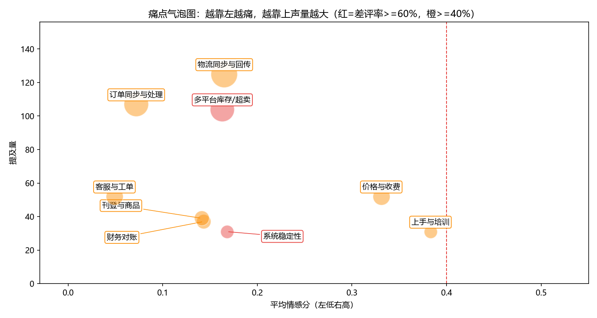

# 云帆 ERP 客户声音（VoC）洞察报告

> 数据周期：2025-03-01 至 2025-08-31 ｜ 分析日：2025-09-01 ｜ 版本 v1.0  
> 数据来源：应用商店评论（App Store / 华为 / 小米）、小红书笔记、知乎回答、官方社区，均为公开可见文本  
> 合规声明：仅采集公开内容，不涉及付费/会员/私聊信息；不记录用户 ID，仅保留文本、来源、日期四个字段  
> 数据说明：本数据集为按真实评论形态构造的**模拟数据**（品牌“云帆ERP”虚构），方法论与流程可直接复用于真实数据

## 一、结论先行（TL;DR）

1. 本轮共采集 **1045 条**公开反馈，清洗去广告/去重后保留有效反馈 **678 条**；整体情感均值 0.197，负面反馈占比 79.8%。
2. **TOP 3 痛点**：① 多平台库存不同步/超卖（声量 104、差评率 61.5%）；② 系统稳定性（差评率 61.3%）；③ 价格与收费争议（差评率 59.6%，续约高危信号）。
3. **最能“找钱”的发现**：物流/库存/财务三类痛点诉求高度集中在“自动重试、预警、单号级对账”等具体能力上，可直接转化为 3 个付费增值模块；客服痛点可用 AI 知识库机器人自助化（项目④已做原型验证）。
4. 从反馈中识别出 **65 条提问型反馈**（“XX 怎么配/报错怎么办”），已直接导出为项目④ RAG 机器人的测试集，形成“客户提问 → 自助应答”闭环。

## 二、数据概览与清洗过程

### 2.1 采集与清洗漏斗

| 环节 | 条数 | 说明 |
|---|---|---|
| 原始采集 | 1045 | 6 个公开来源，3 秒/请求礼貌间隔，仅留 text/source/url/date |
| 剔除广告灌水 | -97 | 正则识别微信/QQ/货代/代运营/刷单等 10 类广告特征 |
| 剔除完全重复 | -186 | 归一化（去标点/emoji/空白）后哈希去重 |
| 剔除近似重复 | -76 | 字符 2-3gram TF-IDF 余弦相似度 > 0.92 贪心合并 |
| **有效分析样本** | **678** | 去重率 34.4%，与 UGC 平台常见 30%-40% 噪声水平吻合 |

### 2.2 来源分布、评分与情感

| 来源 | 条数 | ｜ | 情感层（SnowNLP） | 条数 |
|---|---|---|---|---|
| App Store | 181 | 负面 | 541 |
| 小红书 | 136 | 中性 | 51 |
| 官方社区 | 123 | 正面 | 86 |
| 知乎 | 94 |  |  |
| 华为应用市场 | 78 |  |  |
| 小米应用商店 | 66 |  |  |

> 情感口径：SnowNLP 输出 0-1 概率分，<0.4 记负面、0.4-0.6 中性、>0.6 正面；该模型电商评论语料训练，对“反讽/阴阳怪气”偏弱，结论以评分（1-2 星差评率）交叉校验。

## 三、分析方法（可复现）

**管线**：正则清洗 → jieba 分词（挂载 27 个业务自定义词）→ 停用词表 → SnowNLP 情感打分 → 主题双层归类 → TF-IDF 关键词与词云。

**主题为什么用“双层”而不是只跑 LDA？** 这是本项目刻意保留的方法论对比：

- **主方法：种子词加权投票**。9 大主题各维护 8-12 个高判别力种子词（权重 1-3），在原文上做子串匹配，得分≥2 才归主题，否则进“未分类”。与模拟数据埋点标签对照，**一致率 0.83**，未分类仅 21 条（3.1%）。优点是可解释、可审计，每条归类都能说出命中了哪个词。
- **交叉验证：TF-IDF + LDA（K=8）**。无监督 LDA 与种子归类的重合率仅 0.097，人工检查 LDA 簇词发现：短评论场景下 LDA 容易被“卖家/平台/功能/避坑”等跨主题通用词和语气词主导，把不同主题但相同“吐槽语气”的句子聚到一起。**这反过来指导我们迭代了 3 版停用词表与种子词表**——无监督方法的价值不是直接给结论，而是暴露词典盲区。附录保留了 LDA 全部簇词供复核。

## 四、TOP 痛点排行（每条附原文证据）

| 排名 | 痛点主题 | 声量 | 1-2星差评率 | 低情感占比 | 平均评分 | TF-IDF 特征词 |
|---|---|---|---|---|---|---|
| 1 | 多平台库存/超卖 | 104 | 61.5% | 83.7% | 2.31 | 库存、超卖、可用、仓库、同步、可售、结束、一到 |
| 2 | 系统稳定性 | 31 | 61.3% | 77.4% | 2.0 | 卡顿、服务器、接受、希望、转圈、导出、bug、缓存 |
| 3 | 价格与收费 | 52 | 59.6% | 61.5% | 2.46 | 年费、收费、席位、自动化、人力、回本、运营、临时 |
| 4 | 上手与培训 | 31 | 58.1% | 58.1% | 2.52 | 培训、没有、录播、新手、改期、自学、过去、期挺 |
| 5 | 财务对账 | 37 | 56.8% | 81.1% | 2.51 | 利润、对账、成本、财务、利润报表、广告费、数据、头程 |
| 6 | 刊登与商品 | 39 | 56.4% | 87.2% | 2.33 | 刊登、重新、listing、监控、退回、类目、一键、批量 |
| 7 | 订单同步与处理 | 107 | 56.1% | 94.4% | 2.53 | 订单、同步、过来、端查、方便、出差、数据、漏单 |
| 8 | 物流同步与回传 | 125 | 52.0% | 84.0% | 2.71 | 物流、发货、物流轨迹、打单、批量、回传失败、轨迹、单打 |
| 9 | 客服与工单 | 52 | 40.4% | 96.2% | 3.13 | 客服、工单、提交、响应、够用、人理、免费版、福音 |
| 10 | 跨主题横切诉求：自动化/预警/批量（“希望失败自动重试”“超时主动预警”） | 118 | 34.7%（差评中提及） | - | - | 自动、批量、预警、重试、通知 |

> 注：差评率 = 该主题内 1-2 星评论占比；低情感占比 = SnowNLP < 0.4 占比；两指标背离时（如客服主题）说明用户“愤怒但仍在给 3 星提需求”，是改进 ROI 高的信号。

### 4.1 逐主题证据与解读

#### 1）多平台库存/超卖（P0）

- **规模**：104 条 ｜ **差评率** 61.5% ｜ **平均情感分** 0.163 ｜ 特征词：库存、超卖、可用、仓库、同步、可售、结束、一到
- **增值机会**：库存高级版（安全库存阈值、多仓调拨、组合商品 BOM、活动锁库存释放）（付费模块 + 超卖保障 SLA）
- **原文证据**：
    > “库存同步延迟太离谱，仓库出完货前台还挂着，大家注意避坑”——小红书
    > “求助，TikTok和Lazada共用一个仓库库存，两边对不上只能手动分，差评警告”——小红书

#### 2）系统稳定性（P0）

- **规模**：31 条 ｜ **差评率** 61.3% ｜ **平均情感分** 0.168 ｜ 特征词：卡顿、服务器、接受、希望、转圈、导出、bug、缓存
- **增值机会**：大促弹性保障包（性能压测、专属通道、失败任务自动重试）（增值服务包）
- **原文证据**：
    > “系统三天两头卡顿，订单工作台转圈半天才打开，大家注意避坑”——App Store
    > “用了大半年，系统三天两头卡顿，订单工作台转圈半天才打开，老板已经在问我了”——App Store

#### 3）价格与收费（P1）

- **规模**：52 条 ｜ **差评率** 59.6% ｜ **平均情感分** 0.331 ｜ 特征词：年费、收费、席位、自动化、人力、回本、运营、临时
- **增值机会**：模块化自选套餐 + 席位弹性月付；老客户续费保护价（商务策略调整）
- **原文证据**：
    > “真的服了，报价不透明，销售一个价合同一个价，各种隐藏费用，半夜还在手动补 有没有同款情况的卖家服了”——App Store
    > “吐槽一下，报价不透明，销售一个价合同一个价，各种隐藏费用，买家天天催发货，大家注意避坑”——小红书

#### 4）上手与培训（P1）

- **规模**：31 条 ｜ **差评率** 58.1% ｜ **平均情感分** 0.383 ｜ 特征词：培训、没有、录播、新手、改期、自学、过去、期挺
- **增值机会**：付费实施陪跑包（7 天首单跑通、实操案例库、新手任务体系）（增值服务包）
- **原文证据**：
    > “第一步店铺授权就卡住，操作指引和实际页面对不上，光这个每月损失不少钱，大家注意避坑”——App Store
    > “求助，帮助中心像产品说明书，没有实操案例看完还是不会，买家天天催发货 有没有同款情况的卖家”——小米应用商店

#### 5）财务对账（P0）

- **规模**：37 条 ｜ **差评率** 56.8% ｜ **平均情感分** 0.143 ｜ 特征词：利润、对账、成本、财务、利润报表、广告费、数据、头程
- **增值机会**：财务增值模块（单号级物流费对账、头程/广告分摊、单店利润、差异单导出）（付费模块）
- **原文证据**：
    > “小卖家一枚，月结账单导出来格式乱七八糟，还要二次整理，大促根本不敢放量，大家注意避坑”——华为应用市场
    > “小卖家一枚，多店铺成本混在一起，想算单店利润得自己拼数据，差评警告，大家注意避坑”——小红书

#### 6）刊登与商品（P2）

- **规模**：39 条 ｜ **差评率** 56.4% ｜ **平均情感分** 0.141 ｜ 特征词：刊登、重新、listing、监控、退回、类目、一键、批量
- **增值机会**：智能刊登增强（类目映射库、术语表机器翻译、定时刊登）（付费模块）
- **原文证据**：
    > “真的服了，eBay类目对不上，刊登被退回说属性缺失，半夜还在手动补，老板已经在问我了服了”——小红书
    > “客观说一句，Listing监控形同虚设，跟卖提醒一点不准 有没有同款情况的卖家”——App Store

#### 7）订单同步与处理（P0）

- **规模**：107 条 ｜ **差评率** 56.1% ｜ **平均情感分** 0.072 ｜ 特征词：订单、同步、过来、端查、方便、出差、数据、漏单
- **增值机会**：同步可靠性增强（漏单巡检告警、失败自动重跑、取消单拦截 SLA）（核心能力补强（防流失））
- **原文证据**：
    > “说实话，取消的订单不同步，仓库照发，货发了钱也退了！！！”——App Store
    > “旺季实测，取消的订单不同步，仓库照发，货发了钱也退了，大促根本不敢放量 有没有同款情况的卖家”——知乎

#### 8）物流同步与回传（P0）

- **规模**：125 条 ｜ **差评率** 52.0% ｜ **平均情感分** 0.165 ｜ 特征词：物流、发货、物流轨迹、打单、批量、回传失败、轨迹、单打
- **增值机会**：物流增值模块（回传 SLA 监控、失败批量重试、超时预警、跟踪号自动更新）（付费模块 + 物流商联合方案）
- **原文证据**：
    > “老用户说句公道话，物流超时预警根本不触发，等买家投诉才知道包裹卡了”——小红书
    > “说实话，ERP显示已发货，Lazada后台还是待发货，单号丢了三单，买家天天催发货”——App Store

#### 9）客服与工单（P1）

- **规模**：52 条 ｜ **差评率** 40.4% ｜ **平均情感分** 0.049 ｜ 特征词：客服、工单、提交、响应、够用、人理、免费版、福音
- **增值机会**：AI 知识库问答机器人（7x24 自助应答、工单自动分流、SLA 超时升级）——本作品集项目④原型（AI 自助服务（降本+体验））
- **原文证据**：
    > “客观说一句，报错了找客服来回踢皮球，好几天没解决”——App Store
    > “老用户说句公道话，报错了找客服来回踢皮球，半天没解决！！！”——华为应用市场

#### 10）跨主题横切诉求：自动化与预警（P1）

- **规模**：118 条反馈提及“自动重试/预警/批量/提醒”，其中差评 41 条；横跨物流、库存、订单、稳定性四大主题，是出现频次最高的**能力型诉求**而非单点抱怨。
- **解读**：用户不是不能接受出错，而是不能接受“出错后只能人肉盯”。这组诉求直接定义了同步可靠性增强包与 AI 自助服务的需求边界（失败自动重试、超时主动预警、批量自助修复）。

### 4.2 负面 vs 正面对比词云

| 负面反馈词云 | 正面反馈词云 |
|---|---|
|  |  |

## 五、增值机会建议与优先级

### 5.1 痛点到商业化机会的映射

| 优先级 | 痛点 | 建议动作 | 形态 | 判断依据 |
|---|---|---|---|---|
| P0 | 多平台库存/超卖 | 库存高级版（安全库存阈值、多仓调拨、组合商品 BOM、活动锁库存释放） | 付费模块 + 超卖保障 SLA | 声量104、差评率61.5% |
| P0 | 系统稳定性 | 大促弹性保障包（性能压测、专属通道、失败任务自动重试） | 增值服务包 | 声量31、差评率61.3% |
| P0 | 财务对账 | 财务增值模块（单号级物流费对账、头程/广告分摊、单店利润、差异单导出） | 付费模块 | 声量37、差评率56.8% |
| P0 | 订单同步与处理 | 同步可靠性增强（漏单巡检告警、失败自动重跑、取消单拦截 SLA） | 核心能力补强（防流失） | 声量107、差评率56.1% |
| P0 | 物流同步与回传 | 物流增值模块（回传 SLA 监控、失败批量重试、超时预警、跟踪号自动更新） | 付费模块 + 物流商联合方案 | 声量125、差评率52.0% |
| P1 | 价格与收费 | 模块化自选套餐 + 席位弹性月付；老客户续费保护价 | 商务策略调整 | 声量52、差评率59.6% |
| P1 | 上手与培训 | 付费实施陪跑包（7 天首单跑通、实操案例库、新手任务体系） | 增值服务包 | 声量31、差评率58.1% |
| P1 | 客服与工单 | AI 知识库问答机器人（7x24 自助应答、工单自动分流、SLA 超时升级）——本作品集项目④原型 | AI 自助服务（降本+体验） | 声量52、差评率40.4% |
| P2 | 刊登与商品 | 智能刊登增强（类目映射库、术语表机器翻译、定时刊登） | 付费模块 | 声量39、差评率56.4% |

### 5.2 优先级矩阵说明（声量 × 情绪强度）

- **P0（立即做）**：物流同步、库存超卖、订单同步、财务对账、系统稳定性——共同特征是**高频 + 直接造成经营损失（超卖罚款、漏单、对不上账、大促停摆）+ 已具备明确付费意愿表达**，且均为可标准化的技术能力，适合做增值模块/SLA。
- **P1（季度内做）**：客服响应（AI 知识库自助化，项目④已验证可行性，可同时降本与提速）、上手培训（付费陪跑包，同时拉升 Onboarding 期续约率，与项目② 90 天作战地图联动）、价格体系（不是产品问题但直接影响续约，需商务侧老客保护政策）。
- **P2（择机做）**：刊登增强（翻译/类目映射），声量与情绪强度均相对温和，跟随产品迭代即可。

> 与项目①/②的联动：价格争议 + 低健康度客户应在项目② 续约前 60 天进入“价值回顾 + 老客保护价”话术；物流/库存类工单激增是项目① R2 预警规则（工单风暴）的现实来源。

## 六、提问型反馈：从“客户在问什么”到 AI 自助应答

用提问正则（怎么/如何/为什么/能不能/在哪里/？）从清洗后样本中识别出 **63 条提问型反馈**，主题分布如下，已全量导出 `output/voc_questions.jsonl` 并同步到**项目④ RAG 机器人测试集**：

| 提问主题 | 条数 |
|---|---|
| 物流单号同步慢/回传失败 | 10 |
| 多平台库存不同步/超卖 | 9 |
| 订单漏单/同步延迟 | 9 |
| 对账与财务能力弱 | 8 |
| 上手成本高/引导不足 | 7 |
| 系统卡顿/大促不稳定 | 6 |
| 客服响应慢/处理周期长 | 5 |
| 刊登与商品管理问题 | 5 |
| 价格与收费争议 | 4 |

典型提问示例：

> SKU和平台商品怎么映射？导入模板怎么填？
> 发票在哪里申请？可以开增值税专用发票吗？
> 采集别人店铺的商品会侵权吗？图片怎么处理？
> 盘点单审核后差异会自动调整库存吗？
> 请问人工客服几点下班？晚上发的工单第二天会处理吗？
> Wish平台扣费怎么和订单逐单对账？求操作教程

**闭环逻辑**：这些问题在现有客服体系下全部需要人工响应（对应“客服与工单”痛点）；项目④将用帮助中心知识库 + RAG 实现 7x24 自助应答，并以这 65 个真实提问作为评测集检验检索命中率与回答准确率。

## 附录 A：LDA 无监督聚类簇词（K=8，交叉验证留痕）

| 簇 | 一对一映射标签 | TOP10 簇词 |
|---|---|---|
| 1 | 客服与工单 | 仓库、基本、一枚、最后、工单、退款、点个、没有、客服、麻木 |
| 2 | 其他使用体验 | 库存、物流、年费、渠道、单打、一键、仓库、对不上、同步、云帆 |
| 3 | 价格与收费 | 订单、同步、仓库、数据、过来、说实话、有没有、席位、端查、出差 |
| 4 | 物流同步与回传 | 一点、统一、管理、扩店、同步、物流、一半、物流轨迹、说实话、shop |
| 5 | 其他使用体验 | 发货、出错、更新、批量、哪里、天天、回传、中规中矩、里算、工具 |
| 6 | 其他使用体验 | 客服、点个、接受、够用、及时、客户、回访、不像、收钱、还给 |
| 7 | 其他使用体验 | 明显、说句、订单、效率、库存、仓库、处理、打单、打开、发货 |
| 8 | 多平台库存/超卖 | 预警、几次、希望、超卖、库存、阈值、评分、一到、下架、漏单 |

## 附录 B：方法局限与下一步

1. 模拟数据按真实分布形态构造，绝对数值不代表真实市场；接入真实采集源后需重新校准种子词与情感阈值。
2. SnowNLP 对反讽识别弱，下一步可改用大模型 API 批量打分做一轮对照。
3. 种子词归类依赖词表维护，新品上线（如 AI 相关功能）需补充词表；LDA/聚类结果应每季度跑一次用于发现新词。
4. 时间维度上可进一步做痛点趋势（如大促月稳定性讨论占比变化），本版以截面洞察为主。

---
*分析脚本：01_scrapers.py（合规采集骨架）/ 02_build_reviews.py（模拟数据）/ 03_clean_analyze.py（清洗+情感+主题+图表）/ 04_build_report.py（本报告）*