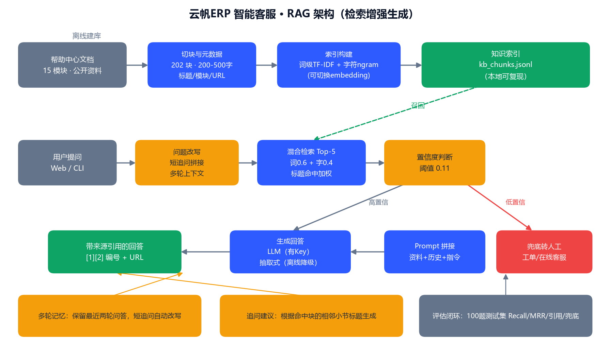

# 项目④：云帆ERP AI 客户支持知识库机器人（RAG）

一个**带来源引用、可离线演示**的跨境电商 ERP 智能客服问答机器人。回答"XX 功能怎么配、报错怎么办"类问题，
检索不到可靠资料时**不编造，自动兜底转人工**。测试集直接复用项目③ VoC 挖掘出的真实客户提问。



---

## 一、它能做什么（demo 四连）

1. **典型功能问题**：`安全库存预警在哪里开？` → 给出操作路径 + 每句带来源 `[1][2]` 与可点击 URL；
2. **报错处理**：`打印控件加载失败连不上打印机` → 五步排查，全部出自知识库原文；
3. **多轮追问**：先问`合单规则在哪里配置`，再追问`拆单呢？` → 自动改写为"合单规则/拆单规则在哪里配置"；
4. **越界兜底**：`你们老板叫什么名字？` → 置信度不足，明确回复转人工（提交工单/在线客服），不硬答。

## 二、RAG 原理（面试版）

- **为什么用检索而不是让大模型直接答？** 大模型参数里没有企业最新帮助文档，直接答会"幻觉"出不存在的菜单路径与政策；
  RAG 先把问题变成向量/关键词去**知识库检索原文**，只把召回资料交给模型，答案就有事实依据。
- **为什么检索要用向量？** 向量按语义相似度匹配，能跨越词面差异（"卖超了"≈"超卖"，英文报错码也能匹配）。
  本项目默认用 **词级 TF-IDF（叠加"口语→术语"低权重同义词扩展）+ 字符 ngram 混合检索**保证零成本离线可跑，
  代码预留 `ApiEmbedRetriever`，配置 embedding API（OpenAI 兼容接口，豆包/DeepSeek/通义均可）即切换为真正的语义向量检索。
- **为什么引用重要？** 引用编号 + URL 让每条答案可核验、出错可追责，也是上线后做答案审计与知识库缺口分析的锚点；
  系统提示词强制"步骤和数字必须来自资料，资料不足必须转人工"。
- **为什么要置信度阈值？** 检索器对任何问题都会返回"最相似"的块，阈值 0.11（由 100 题评估网格标定）
  区分"真相关"与"硬凑的最相似"，低于阈值直接转人工——客服场景宁可兜底，不可误导。

## 三、目录结构

```
project4_rag/
├─ data/
│  ├─ kb_data_part1~7.py     # 知识库内容源（15 模块，自写的跨境ERP帮助文档）
│  ├─ kb_chunks.jsonl        # 切块产物：202 块，200-500 字，带模块/标题/URL 元数据
│  └─ raw_docs/              # 每模块合订 markdown（便于人工审阅）
├─ src/
│  ├─ build_kb.py            # 内容合并 → 展平小节 → 模块级贪心打包切块
│  ├─ rag_engine.py          # 检索/生成/多轮/追问/兜底核心
│  ├─ cli_demo.py            # 命令行交互 demo
│  ├─ app.py                 # Flask Web demo（聊天界面、来源卡片、追问按钮）
│  └─ draw_architecture.py   # 架构图绘制
├─ tests/
│  ├─ voc_questions.jsonl    # 项目③产出的 65 条真实提问（联动数据源）
│  ├─ build_testset.py       # 去重/映射/补充 → 100 题测试集
│  ├─ test_questions.jsonl   # 100 题（60 VoC + 40 人工，含期望模块与关键词）
│  ├─ eval_rag.py            # Recall@K/MRR/模块精度/兜底/答案覆盖网格评估
│  ├─ eval_results.json      # 评估结果
│  ├─ iteration_log.csv      # 12 组参数迭代记录
│  └─ gen_eval_report.py     # 生成《评估报告》PDF
├─ docs/                     # 架构图、评估报告、demo 演示脚本
└─ output/                   # PDF 报告产物
```

## 四、安装与运行

```powershell
pip install -r requirements.txt

# 1) 重建知识库（首次运行可跳过，data/kb_chunks.jsonl 已内置）
python src/build_kb.py

# 2) 命令行 demo（无需任何 API Key，离线抽取式回答）
python src/cli_demo.py

# 3) Web demo：浏览器打开 http://127.0.0.1:5000
python src/app.py

# 4) 跑评估（约 1 分钟）并生成评估报告 PDF
python tests/eval_rag.py
python tests/gen_eval_report.py
```

### 切换为大模型模式（可选）

设置任意 **OpenAI 兼容**接口的环境变量后自动启用，无需改代码：

| 变量 | 说明 | 示例 |
|---|---|---|
| `LLM_API_KEY` | 对话大模型 Key（设置后生成层走 LLM） | `sk-xxx` |
| `LLM_BASE_URL` | 接口地址 | `https://ark.cn-beijing.volces.com/api/v3` |
| `LLM_MODEL` | 模型名 | `doubao-...` / `deepseek-chat` |
| `EMBEDDING_API_KEY` | 向量化 Key（设置后检索层切换语义向量） | `sk-xxx` |
| `EMBEDDING_BASE_URL` / `EMBEDDING_MODEL` | embedding 地址与模型 | 同上 |

无 Key 时：混合检索 + 从原文抽取句子的模板化回答，**现场断网也能 demo 全链路**；LLM 调用失败会自动降级为该模式。

## 五、评估结果（100 题测试集）

| 指标 | 结果 | 说明 |
|---|---|---|
| Recall@5 | **0.97** | 97% 的问题 Top5 内找回正确模块 |
| MRR | **0.89** | 正确块大多排在第 1-2 位（查询扩展开启后 0.89 vs 关闭 0.87） |
| 模块精度@5 | 0.56 | Top5 噪声块比例，供 prompt 与引用筛选参考 |
| 答案关键词覆盖 | **0.86** | 抽取式答案命中人工标注关键词的比例（消融：关闭扩展 0.83） |
| 答案产出率 | **0.975** | 40 道人工题中成功组织出答案的比例 |
| 错误转人工 | 1/40 | 安全失败；越界问题全部正确兜底 |

关键迭代结论（完整 13 组记录见 `tests/iteration_log.csv` 与《评估报告》PDF）：
200-500 字模块级打包优于 240 字小窗口（排查步骤不被拆散）；TopK=5 召回优先于 K=3；
词/字权重 0.6/0.4 兼顾错字鲁棒性与精度；**约 40 条"客服口语→文档术语"查询扩展**（词条源自项目③真实提问）
以 0.5 低权重注入，消融实验 MRR/模块精度/答案覆盖均提升且无劣化；抽取覆盖阈值 `EXTRACT_COVER_THRESHOLD=0.25` 可配置；
置信阈值 0.11 卡在域内最低分(0.098)与越界最高分(0.092)之间，余量留作兜底保护。

## 六、与作品集其他项目的联动

- 测试集 60 题来自**项目③ VoC**：从应用商店/社媒评论中清洗、聚类后识别出的真实提问型反馈，
  证明机器人不是"为技术而技术"，而是回答客户真的在问的问题；
- 知识库覆盖的高频痛点（库存同步、物流回传、报表超时）正对应项目③痛点排行与增值机会建议；
- 故事线：③ 发现客户在问什么 → ① 建指标预警流失 → ② 设计 90 天经营动作 → ④ 把高频问题用 AI 自助化。

## 七、Demo 视频

录制脚本与操作指引见 [docs/demo_script.md](docs/demo_script.md)（2 分钟版讲解词 + 屏幕操作顺序）。
